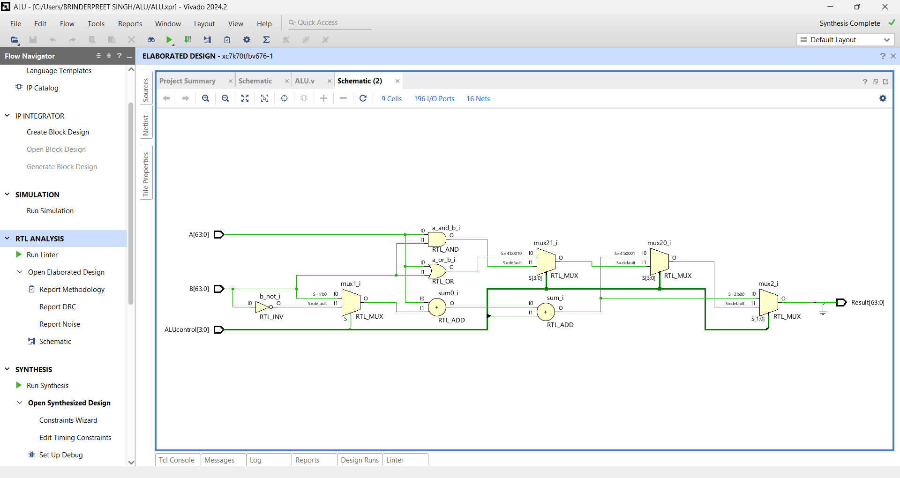
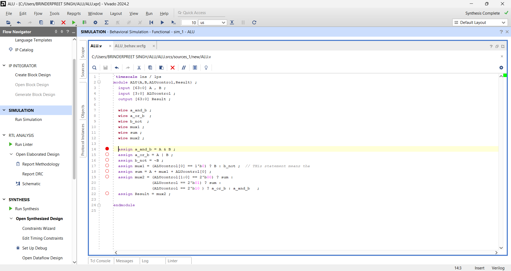

# Verilog-Projects
A collection of Verilog-based digital designs and simulations. Includes basic and advanced circuits such as a 4-bit ALU, Johnson counter, D flip-flop, and more. Implemented and tested using simulation tools like Icarus Verilog and Vivado.

## RISC-V Processor Schematic
The following schematic represents the architecture of our RISC-V processor design.

## ALU Simulation Result

## ALU Verilog Code

